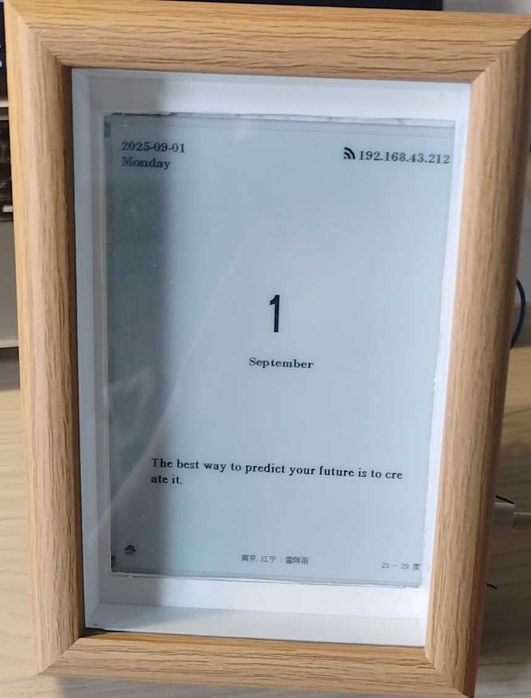
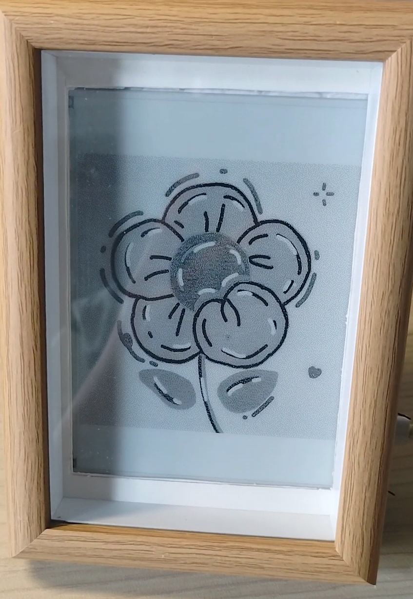

# MoreInk

5.83寸墨水屏开发的电子日历以及相框

 

## 硬件准备

ESP32

驱动板

5.83寸墨水屏

### 连线规则

对于Goodisplay的屏幕，连线应该是

- SCK GPIO18

- MOSI(SDA, SDIN) GPIO23

- SS(CS) GPIO27

- BUSY GPIO13

- RST GPIO12

- DC GPIO14

对于电容式触摸引脚GPIO4和GPIO32，需要自己引出线，方便触摸

## 使用到的库

下述库体积太大，并未上传。用户需要自己下载，并将其放在lib文件夹下。

- Adafruit_BusIO

- Adafruit_GFX_Library

- ArduinoJson

- ArduinoUZlib

- GxEPD2

- U8g2_for_Adafruit_GFX

## 使用方法

### 配置网络

本项目只有在ESP32连接到互联网后才可以使用全部功能。第一次启动需要根据提示进行配网。

开机，待屏幕出现配网提示（或调试时在串口打印出提示信息）后，用其他设备连接wifi: MoreInk-ESP32, 密码: 11223333。在浏览器中访问主页右上角的IP地址, 并填入可用的wifi名称与密码。在该界面还需要填入和风天气的API以及相应的密钥，以获取正常的天气服务。重启以重新联网。此处还可以填入代办事项，在屏幕的代办页呈现。

所填入的信息在下次开机后会自动读取，不必重新填入。

### 页面与功能

- 主页：日期、星期、天气、每日一言

- 代办页：显示用户填写的代办事项。填写规范：中英文数字皆可，代办事项之间用分号（中英文皆可）隔开，总条数不超过6条。建议每条代办事项字数不要过多，防止显示异常。

- 新闻页：当天的新闻

- 历史页：历史上的今天发生了哪些事情

- 图片页：显示用户在IMAGE.h中载入的图片

设置了NEXT键（GPIO4）和HOME键（GPIO32）。单击NEXT键实现页面转换，单击HOME键快速进入图片页，长按NEXT键刷新本页，多用于图片页切换图片。

#### 如何在图片页显示自定义的图片

首先需要将图片裁剪到合适的尺寸：宽度不超过480像素，高度不超过648像素，然后进行图像取模。（建议尺寸：480×648或480×480，否则图片在墨水屏上居中显示不满）这里推荐两个网站：
尺寸不变，像素数改变：https://resizepanda.com/
取模网站：https://www.e-paper-display.com/Image2LCD-CN.html
一般选择水平扫描，自底向上，颜色不反转，使用下述配套函数及颜色参数

将得到的数组粘贴进IMAGE.h，并在PageManager.cpp中修改EpdBitmap imageArray[]。命名和修改方式参考已有代码的示例。重新烧录程序至ESP32，即可在图片页看到自己传入的图片！
